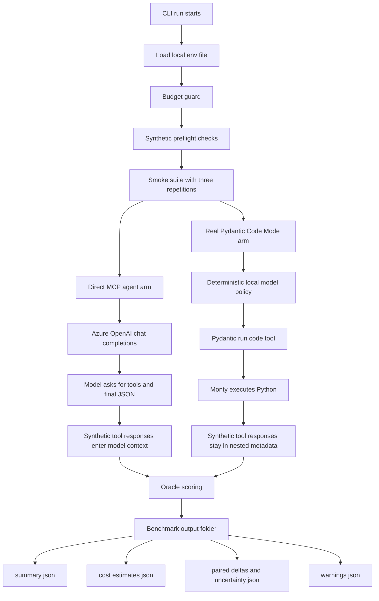

# Benchmark Run Flow

This diagram explains the current bounded run:

```bash
--preset smoke --arms direct_agent,code_mode_real --repetitions 3 --arm-order randomized
```

The run compares a live Azure OpenAI direct-agent arm against a real Pydantic
Code Mode/Monty runtime arm that uses a deterministic local model policy.

## End-To-End Flow



## Arm Behavior

```mermaid
graph LR
    Runner[Benchmark runner] --> Direct[Direct agent arm]
    Direct --> Azure1[Azure request one]
    Azure1 --> SearchTool[Search shard tool]
    SearchTool --> Azure2[Azure request two]
    Azure2 --> FetchTool[Fetch candidate tool]
    FetchTool --> Azure3[Azure request three]
    Azure3 --> DirectAnswer[Final JSON answer]
    DirectAnswer --> DirectMetrics[Visible tool bytes and usage]

    Runner --> CodeMode[Code Mode arm]
    CodeMode --> Policy[Local deterministic policy]
    Policy --> RunCodeCall[run code call]
    RunCodeCall --> MontyRuntime[Monty sandbox]
    MontyRuntime --> NestedSearch[Nested search shard call]
    NestedSearch --> NestedFetch[Nested fetch candidate call]
    NestedFetch --> CodeAnswer[Final structured answer]
    CodeAnswer --> CodeMetrics[Hidden nested bytes and usage]

    DirectMetrics --> Score[Shared scoring]
    CodeMetrics --> Score
```



## What Is Sent And Returned

### Direct Azure MCP Agent Arm

The direct arm sends a normal Azure OpenAI chat-completions request on every
model turn. Each request includes:

- the original task prompt
- the answer schema
- the synthetic tool definitions
- the current turn index
- any tool results returned since the previous model turn

For the example smoke run, the first user message is built from this task:

```text
Rank the top candidates most ready to merge. Exclude drafts and bot-authored candidates. Consider approvals, CI status, reactions, recency, changed-file count, and relevance. Return structured JSON.
```

The first Azure response returned a tool call:

```json
{"name":"search_shard","arguments":{"shard_id":0}}
```

The runner executed the synthetic tool and sent this tool result back to Azure
on the next request:

```json
{"category":"infra","id":"cand-0000","shard_id":0,"title":"tests candidate 0"}
```

The second Azure response returned another tool call:

```json
{"name":"fetch_candidate","arguments":{"candidate_id":"cand-0000"}}
```

The runner executed that tool and sent the full candidate payload back to Azure
on the third request. The full payload includes fields such as approvals,
checks, changed files, age, reactions, relevance, and the synthetic payload
body:

```json
{"age_days":45,"approvals":0,"category":"infra","changed_files":38,"failing_checks":1,"id":"cand-0000","is_bot_authored":false,"is_draft":false,"reactions":8,"relevance":0.4528,"shard_id":0,"title":"tests candidate 0"}
```

The third Azure response returned the final answer JSON:

```json
{"task_id":"smoke_smoke_single_lookup","candidates":[{"id":"cand-0000","score":0.4528,"score_breakdown":{"age_days":-0.45,"approvals":0.0,"changed_files":-0.38,"failing_checks":-1.0,"reactions":0.08,"relevance":0.4528}}]}
```

In this arm, the synthetic tool results are model-visible. In the latest run,
that was `567` tool-response bytes per repetition.

### Real Pydantic Code Mode And Monty Arm

The Code Mode arm does not send the synthetic tool results to Azure. In the
current implementation, the model policy is a local deterministic Pydantic AI
`FunctionModel`. The real part being tested is Pydantic Code Mode plus Monty.

The local model receives the task prompt and returns one `run_code` tool call:

```json
{"tool_name":"run_code","arguments":{"restart":true,"code":"import asyncio\n\nshards = await asyncio.gather(...)\n..."}}
```

The generated Python program calls the same synthetic tools inside the Monty
sandbox:

```python
shards = await asyncio.gather(search_shard(shard_id=0))
candidate_ids = [item["id"] for shard in shards for item in shard]
fetched = await asyncio.gather(
    *[fetch_candidate(candidate_id=candidate_id) for candidate_id in candidate_ids]
)
```

Monty sees the same summary and full candidate payload that the direct arm sent
back to Azure, but those payloads stay inside nested `run_code` metadata instead
of becoming chat tool messages for the model.

The local model then receives the `run_code` return value and returns it as the
final structured answer:

```json
{"task_id":"smoke_smoke_single_lookup","candidates":[{"id":"cand-0000","score":0.38048,"score_breakdown":{"approvals":0.0,"ci":0.15,"reactions":0.016,"recency":0.025,"relevance":0.15848,"size":0.031}}]}
```

In this arm, the synthetic tool results are not model-visible. In the latest
run, that was still `567` fetched tool-response bytes per repetition, but `0`
model-visible tool-response bytes.

## What The Latest Successful Run Showed

Artifact path:

```text
benchmarks/outputs/20260507T054103Z
```

Key observations over three paired trials:

- Both arms returned schema-valid answers with `NDCG = 1.0`.
- Direct Azure arm used `3` model requests per trial.
- Code Mode/Monty arm used `2` model requests per trial.
- Direct Azure arm exposed `567` tool-response bytes per trial to the model.
- Code Mode/Monty arm hid those tool-response bytes inside `run_code` execution metadata.
- Direct Azure estimated live cost for this run was about `$0.003055`.

## Important Caveats

- `code_mode_pydantic_monty` uses real Pydantic Code Mode and Monty, but its
  model policy is deterministic and local. It is not live Azure model behavior.
- Azure pricing is currently assumption-backed from the OpenAI pricing evidence
  row, not verified Azure billing evidence.
- Three repetitions are useful for smoke confidence, not publishable benchmark
  claims.
- The valid Azure env file must contain both the full chat-completions endpoint
  and the matching Azure OpenAI key.
